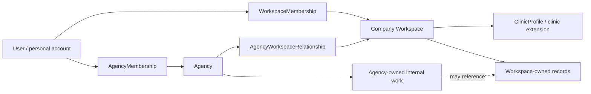

# Domain Ownership Model

```text
Status: architecture source of truth
Scope: users, agencies, company workspaces, memberships, access, and data ownership
Last updated: 2026-05-23
```

## Purpose

This document defines the mature business-domain model for the portal.

The core distinction:

```text
User != Agency
User != Company / Workspace
Agency member != Company member
Role != Profile
Access != URL parameter
```

The current codebase still uses legacy names such as `client`, `client_id`, and
`profile.role`. New product and architecture decisions should treat those names
as compatibility labels, not as the final business model.

The mature model is:

```text
User
  personal account / identity

Agency
  provider organization that serves client companies

Company Workspace
  client business account, such as a clinic, brand, or business location group

Agency Membership
  the relationship that lets a user act inside an agency

Workspace Membership
  the relationship that lets a user act inside a client company workspace
```

## Design Principles

### 1. A user owns identity, not business data

A `User` is a person who can log in. The user owns account-level identity and
preferences. The user does not own reports, clinic metrics, tasks, requests, or
business settings directly.

Business records should reference users as actors:

```text
created_by_user_id
updated_by_user_id
published_by_user_id
approved_by_user_id
submitted_by_user_id
```

That actor reference is not ownership.

### 2. Business access comes from memberships

Access must be derived from active membership records.

```text
User + active AgencyMembership = can act inside agency scope
User + active WorkspaceMembership = can act inside company workspace scope
```

Do not grant access from profile fallback fields such as:

```text
profile.role
profile.client_id
profile.client_ids
profile.agency_id
```

Those fields are legacy compatibility data until the migration is complete.

### 3. Agency and workspace are separate ownership containers

The agency owns provider-side operations:

```text
internal tasks
agency team membership
playbooks
templates
internal activity
managed workspace relationships
```

The company workspace owns client business context:

```text
company profile
clinic profile
workspace members
client-visible work
needed actions
reports
dashboards
files
requests
updates
clinic metrics
compliance approvals
```

The agency may manage a workspace, but that does not make workspace records
personal property of an agency member.

### 4. Roles live on relationships

A user's capabilities depend on where the user is acting.

The same person can be:

```text
- agency admin in Agency A
- agency contractor in Agency B
- clinic owner in Workspace C
- viewer in Workspace D
```

Therefore role and capability data belongs on membership records, not on the
global user profile.

### 5. Client-facing records are deliberate projections

Internal agency work is not automatically client-visible.

Client-facing work should be represented by explicit workspace-owned records:

```text
ClientWorkItem
NeededFromClient
ClientRequest
ClientUpdate
ClientReport
DashboardLink
FileLink
MedicalApproval
ComplianceReview
```

Internal `Task` records can reference these records, but should not become the
client-facing contract by themselves.

## Entity Ownership Summary

| Entity | Owns | Does not own |
| --- | --- | --- |
| User | identity, login, personal preferences, personal account lifecycle | agency role, workspace role, client data, reports, tasks |
| Agency | provider organization, agency settings, team, internal work, managed workspace relationships | clinic metrics, client company identity, client members' personal accounts |
| Company Workspace | client business context, workspace settings, workspace members, client-visible records, clinic data | agency internal notes, agency profitability, agency member personal accounts |
| AgencyMembership | user's agency role, status, capabilities, agency-scoped permissions | user identity, workspace membership |
| WorkspaceMembership | user's workspace role, status, capabilities, workspace-scoped permissions | user identity, agency permissions |

## User

### Definition

A `User` is the personal account and authentication identity for a real person.

Current implementation mapping:

```text
Current: src/entities/profile
Future: User / Account / Profile
Storage today: profiles, auth_credentials
```

### User-owned data

The user owns:

```text
- user id
- email / login identifier
- display name
- avatar or initials
- personal profile fields
- password or credential reference
- account status
- personal notification defaults
- appearance/theme preference
- personal security settings
- active sessions/devices, later
- account deactivation state
```

### User-scoped actions

A user should generally be able to:

```text
- view and edit their own profile
- change password/security settings
- configure personal notifications
- leave a workspace where policy allows it
- request deletion/deactivation of their own account
```

### User must not own

A user must not directly own:

```text
- agency role
- workspace role
- agency clients
- clinic records
- reports
- dashboards
- tasks
- client requests
- patient acquisition metrics
- company deletion rights without workspace ownership
```

### Important invariant

```text
Deleting or deactivating a user account should not delete agency data or
workspace data by default.
```

Instead, records should keep actor references where needed:

```text
published_by_user_id = "user_123"
published_by_display_name_snapshot = "Mia Chen"
```

## Agency

### Definition

An `Agency` is the provider organization using the product to manage client
companies.

Current implementation mapping:

```text
Current: implicit agency_id fields
Future: agencies collection/table
Future membership: agency_memberships collection/table
```

### Agency-owned data

The agency owns:

```text
- agency id
- agency name
- agency brand/profile
- agency billing/subscription settings, later
- agency-level integrations, later
- agency team membership
- agency roles/capabilities
- managed workspace relationships
- internal tasks
- internal comments/notes
- internal activity/audit events
- internal templates/playbooks
- service packages/scopes, later
- agency-wide dashboard/report templates, later
```

### Agency-scoped actions

Agency users should generally be able to perform actions based on
`AgencyMembership`:

```text
- create a new company workspace
- invite agency team members
- assign agency members to managed workspaces
- manage internal tasks
- publish client-visible work items
- publish reports
- manage dashboard links
- triage client requests
- manage compliance/approval workflows
- remove agency members, when allowed
- delete or archive agency-owned records, when allowed
```

### Agency must not own

The agency must not directly own:

```text
- a user's personal identity
- client company members' personal settings
- patient-level records
- client company deletion without workspace authorization/policy
```

### Agency-to-workspace relationship

The mature model should include an explicit relationship:

```text
AgencyWorkspaceRelationship
  agency_id
  workspace_id
  status: active | paused | ended
  service_scope
  assigned_agency_member_ids
  created_at
  ended_at
```

This relationship answers:

```text
Can this agency manage this workspace?
Which services does the agency provide?
Which agency members are assigned?
Is the relationship active?
```

## Agency Membership

### Definition

An `AgencyMembership` connects a user to an agency.

This is the source of agency-side role and capability.

Current implementation mapping:

```text
Current: partially represented by profile.role and profile.agency_id
Future: agency_memberships
```

### AgencyMembership-owned data

The membership owns:

```text
- membership id
- user_id
- agency_id
- agency role
- status
- capabilities
- assigned workspace ids, optional
- invitation/source metadata
- joined_at
- removed_at
- removed_by_user_id
```

### Recommended agency roles

```text
agency_owner
agency_admin
agency_manager
agency_team
agency_contractor
agency_viewer
```

### Recommended agency capabilities

Capabilities should be explicit enough that UI and policies can avoid hard-coded
role assumptions:

```text
- agency.manage_settings
- agency.manage_members
- workspace.create
- workspace.manage_relationships
- workspace.manage_access
- reports.publish
- dashboards.manage
- tasks.manage
- requests.triage
- compliance.manage
- files.publish
- activity.view_internal
```

### Important invariant

```text
An agency member can be an actor on workspace records only if their agency has
an active relationship with that workspace and the membership grants the needed
capability.
```

## Company Workspace

### Definition

A `Company Workspace` is the client business container. For the clinic vertical,
this is the clinic or clinic group workspace.

Current implementation mapping:

```text
Current: src/entities/client
Current storage: clients
Future name: company_workspaces or workspaces
```

The current `client` naming means "client company workspace", not "individual
client user".

### Workspace-owned data

The workspace owns:

```text
- workspace id
- company/legal/display name
- workspace type: clinic | generic | other verticals later
- workspace status
- portal slug or route key
- brand/logo/colors for client-facing portal
- workspace settings
- workspace members
- workspace invitations
- managed agency relationship
- client-visible work items
- client-needed actions
- client requests
- client-visible updates
- reports and report archive
- dashboard links/embeds
- files and shared links
- activity/audit records scoped to the workspace
- access/settings records
```

For clinic workspaces, it also owns:

```text
- clinic profile
- clinic locations
- service lines
- patient acquisition snapshots
- call and booking metrics
- booking pipeline snapshots
- reputation snapshots
- service-line performance
- location performance
- compliance reviews
- medical approvals
- clinic executive/weekly/monthly performance periods
```

### Workspace-scoped actions

Workspace members should generally be able to perform actions based on
`WorkspaceMembership`:

```text
- view their workspace portal
- view published reports/dashboards
- respond to needed actions
- submit requests
- upload client assets, if allowed
- approve or request changes on approvals, if allowed
- manage workspace members, if owner/admin
- edit workspace/business settings, if owner/admin
- request workspace/business deletion, if owner/admin
```

### Workspace must not own

A workspace must not own:

```text
- agency internal notes
- agency profitability
- agency team workload
- agency member personal account settings
- raw internal task comments
- unpublished dashboards
- draft reports
- patient-level PHI/medical records in the MVP architecture
```

### Clinic-specific invariant

Clinic data must stay aggregate-first unless a separate compliance architecture
is designed and approved.

Allowed aggregate examples:

```text
12 calls
7 booked appointments
3 missed calls
cost per booked appointment
reviews gained
service-line conversion rate
location performance
```

Not allowed in the current product model:

```text
patient name
patient email
patient phone number
diagnosis
medical record number
date of birth
patient-level ad attribution
clinical notes
```

## Workspace Membership

### Definition

A `WorkspaceMembership` connects a user to a company workspace.

Current implementation mapping:

```text
Current: src/entities/client-membership
Current storage: client_memberships
Future name: workspace_memberships
```

### WorkspaceMembership-owned data

The membership owns:

```text
- membership id
- user_id
- workspace_id
- workspace role
- status
- capabilities
- invitation/source metadata
- joined_at
- removed_at
- removed_by_user_id
- workspace notification preferences, optional
```

### Recommended generic workspace roles

```text
workspace_owner
workspace_admin
workspace_member
workspace_viewer
```

### Recommended clinic workspace roles

Clinic workspaces need more precise roles because practice owners, doctors,
front desk staff, and finance/admin staff need different surfaces:

```text
clinic_owner
practice_manager
doctor_reviewer
front_desk
marketing_contact
finance_contact
viewer
```

### Recommended workspace capabilities

```text
- workspace.view_portal
- workspace.manage_settings
- workspace.manage_members
- workspace.request_deletion
- actions.respond
- approvals.review
- approvals.medical_approve
- requests.create
- files.upload
- files.view
- reports.view
- dashboards.view
- clinic_metrics.view
- reputation.respond
- compliance.review
```

### Important invariant

```text
Removing a workspace membership must revoke portal access even if the user's
profile still contains a legacy client_id or client_ids field.
```

## Actor vs Owner

The same record can have an owner and several actors.

Examples:

### Report

```text
owner: workspace_id
created_by_user_id: agency member
published_by_user_id: agency member
visible_to: workspace members with reports.view
```

The report belongs to the workspace because it is part of the client company
record. The agency member is the author/publisher actor.

### Client request

```text
owner: workspace_id
submitted_by_user_id: workspace member
triaged_by_user_id: agency member
assigned_agency_member_id: agency member, optional
```

The request belongs to the workspace. It may be processed by the agency.

### Medical approval

```text
owner: workspace_id
requested_by_user_id: agency member
approved_by_user_id: doctor_reviewer or clinic_owner
related_campaign_id: optional
related_file_id: optional
```

The approval belongs to the clinic workspace and must remain auditable.

### Internal task

```text
owner: agency_id
source_workspace_id: optional
assigned_to_user_id: agency member
client_visible_work_item_id: optional
```

The task belongs to the agency internal workflow. It is not automatically
client-visible.

## Relationship Model



## Access Rules

### Global rules

```text
1. User identity alone does not grant agency or workspace access.
2. Agency access requires an active AgencyMembership.
3. Workspace access requires an active WorkspaceMembership.
4. Agency-to-workspace management requires an active AgencyWorkspaceRelationship.
5. A route parameter is a requested resource id, not proof of access.
6. UI may hide unavailable actions, but domain services must enforce access.
7. Client-facing routes must read published/client-safe records only.
8. Internal notes, drafts, hidden state, and unpublished records remain agency-only.
```

### Agency user opening a workspace admin page

Required:

```text
- active user session
- active AgencyMembership
- required agency capability
- active AgencyWorkspaceRelationship for the requested workspace
```

Optional:

```text
- assigned workspace relationship, if the agency uses account ownership
```

### Workspace user opening client portal

Required:

```text
- active user session
- active WorkspaceMembership for the requested workspace
- required workspace capability
```

Not sufficient:

```text
- profile.client_id
- profile.client_ids
- matching email domain
- remembered last workspace
```

### User opening account settings

Required:

```text
- active user session
```

Scope:

```text
- personal profile
- personal security
- personal notifications
- account deactivation/request deletion
```

Not scope:

```text
- workspace deletion
- agency deletion
- member removal
- reports/tasks/dashboard ownership
```

### Workspace owner/admin opening workspace settings

Required:

```text
- active WorkspaceMembership
- workspace.manage_settings or workspace.manage_members capability
```

Scope:

```text
- business profile
- workspace team
- workspace notifications/preferences
- portal settings
- request workspace/business deletion
```

## Current Implementation Mapping

| Mature concept | Current code/storage | Notes |
| --- | --- | --- |
| User | `src/entities/profile`, `profiles`, `auth_credentials` | Contains legacy role/client/agency fields that should not remain authoritative. |
| Agency | implicit `agency_id` | Needs explicit `agencies` model/table later. |
| AgencyMembership | `profile.role`, `profile.agency_id` compatibility | Needs explicit `agency_memberships`. |
| Company Workspace | `src/entities/client`, `clients` | `client` currently means business workspace. |
| WorkspaceMembership | `src/entities/client-membership`, `client_memberships` | Should become the source of client portal access. |
| WorkspaceInvitation | `src/entities/client-invitation`, `client_invitations` | Should remain lifecycle/audit controlled. |
| Client-visible work | `client_work_items` | Mature client-facing active-work contract. |
| Internal task | `tasks` | Agency/backstage workflow, not client-facing source of truth. |
| Needed action | `needed_from_client` | Workspace-owned client obligation/response workflow. |
| Client request | `client_requests` | Workspace-owned intake workflow. |
| Report | `reports` | Workspace-owned, agency-authored/published. |
| Dashboard link | `dashboard_links` | Workspace-owned external dashboard reference. |
| File/link | `client_file_links` | Workspace-owned visible resource. |
| Activity/audit | `activity_events` | Domain activity stream; visibility depends on audience. |
| Clinic profile | `clinic_profiles` | Workspace-owned clinic extension. |
| Clinic metrics | `patient_acquisition_snapshots`, `call_booking_metrics`, `booking_pipeline_snapshots`, `reputation_snapshots`, `service_line_performance`, `location_performance` | Workspace-owned aggregate clinic read models. |
| Compliance/approval | `compliance_reviews`, `medical_approvals` | Workspace-owned clinic workflow records. |

## Migration Direction

### Phase 1 - Document and enforce semantics in new work

Checklist:

```text
[ ] Treat `client` as `company workspace` in architecture decisions.
[ ] Avoid adding new authoritative checks based on `profile.client_id`.
[ ] Avoid adding new authoritative checks based on `profile.role`.
[ ] Keep new role/capability logic membership-oriented.
[ ] Keep user account settings separate from workspace/company settings.
```

### Phase 2 - Introduce explicit Agency model

Checklist:

```text
[ ] Add `agencies`.
[ ] Add `agency_memberships`.
[ ] Add agency membership domain policies.
[ ] Move agency role/capability logic out of profile model.
[ ] Keep compatibility adapters for seeded/localStorage data.
```

### Phase 3 - Introduce explicit agency-workspace relationship

Checklist:

```text
[ ] Add `agency_workspace_relationships`.
[ ] Scope agency admin workspace access through relationship + membership.
[ ] Support assigned account owners or teams.
[ ] Keep direct client portal access based on workspace membership only.
```

### Phase 4 - Rename client language toward workspace/company

Checklist:

```text
[ ] Introduce workspace-facing domain aliases.
[ ] Rename route metadata and docs where possible.
[ ] Rename repositories only after adapters and tests make it safe.
[ ] Keep public route URLs stable unless product explicitly changes them.
```

### Phase 5 - Remove profile fallback authority

Checklist:

```text
[ ] Remove `profile.client_id` as access source.
[ ] Remove `profile.client_ids` as access source.
[ ] Remove global `profile.role` as authorization source.
[ ] Keep display/contact profile fields only.
[ ] Verify client access revocation through membership removal.
```

## Anti-Patterns To Avoid

```text
- Treating `profile.role` as the user's universal role.
- Treating `profile.client_id` as proof of workspace access.
- Storing workspace settings in the user profile.
- Storing agency settings in the user profile.
- Letting agency users personally own client company records.
- Letting client users mutate internal agency tasks directly.
- Showing internal task lists as the client-facing work contract.
- Copying live workflow records into overview snapshots without a historical need.
- Attaching clinic metrics to agency records instead of workspace records.
- Storing patient-level health data in the MVP portal.
- Mixing account deletion, workspace deletion, and agency deletion in one action.
```

## Product Examples

### Example 1 - Clinic owner

```text
User:
  id: user_sarah
  email: sarah@greendental.example

WorkspaceMembership:
  user_id: user_sarah
  workspace_id: workspace_green_dental
  role: clinic_owner
  capabilities:
    - workspace.view_portal
    - workspace.manage_settings
    - workspace.manage_members
    - workspace.request_deletion
    - approvals.medical_approve
    - reports.view
    - dashboards.view
    - clinic_metrics.view
```

Sarah can manage Green Dental's workspace settings and approve medical claims.
She cannot access agency internal profitability or another clinic's workspace.

### Example 2 - Agency account manager

```text
User:
  id: user_mia
  email: mia@growthlab.example

AgencyMembership:
  user_id: user_mia
  agency_id: agency_growthlab
  role: agency_manager
  capabilities:
    - tasks.manage
    - reports.publish
    - dashboards.manage
    - requests.triage
    - compliance.manage

AgencyWorkspaceRelationship:
  agency_id: agency_growthlab
  workspace_id: workspace_green_dental
  status: active
```

Mia can manage Green Dental from the agency admin side because her agency has an
active relationship with the workspace. She does not become a Green Dental
workspace member unless she also has a `WorkspaceMembership`.

### Example 3 - Front desk user

```text
User:
  id: user_olena

WorkspaceMembership:
  user_id: user_olena
  workspace_id: workspace_green_dental
  role: front_desk
  capabilities:
    - workspace.view_portal
    - actions.respond
    - requests.create
    - clinic_metrics.view
```

Olena can view call/booking issues and respond to operational needed actions,
but cannot delete the workspace or approve medical claims.

### Example 4 - Report ownership

```text
Report:
  id: report_may
  workspace_id: workspace_green_dental
  period: May 2026
  published_by_user_id: user_mia
```

The report belongs to Green Dental's workspace. Mia is the publishing actor.
If Mia leaves the agency, the report remains part of the workspace archive.

## Deletion And Deactivation Boundaries

### User account deactivation

Scope:

```text
- disables login
- ends or marks personal sessions inactive
- may mark personal profile inactive
```

Should not automatically:

```text
- delete agency
- delete workspace
- delete reports
- delete tasks
- delete audit history
```

### Workspace deletion request

Scope:

```text
- requested by workspace owner/admin
- affects company workspace data
- should enter review/confirmation workflow
- may require agency/admin handling in current product
```

Should not automatically:

```text
- delete user accounts
- delete agency account
- delete unrelated workspaces
```

### Agency deletion request

Scope:

```text
- requested by agency owner
- affects agency settings, memberships, and internal operations
- must define what happens to managed workspaces
```

Should not be mixed with:

```text
- user account deletion
- client company workspace deletion
```

## UI And Navigation Implications

### Account settings

Account settings are user-owned.

They should include:

```text
- personal profile
- personal security
- personal notifications
- account deactivation/request deletion
```

They should not include:

```text
- agency deletion
- workspace deletion
- workspace team management
- client reports
- internal tasks
```

### Workspace settings

Workspace settings are company-owned.

They should include:

```text
- company/clinic profile
- portal settings
- workspace team
- workspace notifications
- access/invitations
- workspace deletion request
```

They should not include:

```text
- personal password
- personal account deletion
- agency internal team management
```

### Agency settings

Agency settings are agency-owned.

They should include:

```text
- agency profile/brand
- agency team
- agency subscription, later
- agency integrations, later
- managed workspace relationships
- agency deletion request, later
```

They should not include:

```text
- workspace owner personal profile
- workspace member password/security settings
```

## Open Decisions

These are not implementation blockers, but should be resolved before backend
schema hardening:

```text
[ ] Should the final persisted name be `workspaces`, `company_workspaces`, or `client_workspaces`?
[ ] Should a company be able to own multiple workspaces, such as one per location group or brand?
[ ] Should agency workspace assignment be stored on `AgencyWorkspaceRelationship` or a separate `AgencyWorkspaceAssignment`?
[ ] Which clinic workspace roles are required for the first paid vertical workflow?
[ ] Which agency capabilities should be feature flags versus membership permissions?
[ ] What is the exact deletion lifecycle for user, workspace, and agency records?
```

## Pre-Refactor Decisions

Before the entity/access refactor starts, resolve or explicitly accept the
following decisions. These are the questions that prevent role, sidebar,
settings, and deletion behavior from being patched on top of ambiguous domain
ownership.

### 1. Final entity names

Decision to make:

```text
[ ] Confirm final product/code vocabulary for the primary container.
```

Recommended contract:

```text
User
Agency
Workspace
AgencyMembership
WorkspaceMembership
AgencyWorkspaceRelationship
```

Use `CompanyProfile` as business data inside a workspace, not as the main access
container.

For clinics:

```text
Workspace = product/access/data container
CompanyProfile = business profile
ClinicProfile = healthcare vertical extension
```

Avoid introducing new architecture that treats `client` as an individual user.
In the current codebase, `client` means client company workspace.

### 2. Workspace-to-company cardinality

Decision to make:

```text
[ ] Decide whether one company always equals one workspace.
[ ] Decide whether one company can have multiple workspaces later.
[ ] Decide whether multiple agencies can serve one workspace.
```

Recommended current contract:

```text
Agency -> many Workspaces
Workspace -> one primary CompanyProfile or ClinicProfile
Workspace -> one managing Agency for now
```

Do not build multi-agency management yet, but keep
`AgencyWorkspaceRelationship` as the relationship boundary so agency access does
not depend on `workspace.agency_id` forever.

### 3. Workspace creation lifecycle

Decision to make:

```text
[ ] Decide who can create a workspace.
[ ] Decide whether a workspace may exist without an agency.
[ ] Decide whether client self-serve workspace signup is in scope.
```

Recommended current contract:

```text
Agency admin creates the workspace.
Agency invites workspace members.
Client owner/practice manager can manage members and settings after activation.
Self-serve workspace creation is out of scope for now.
```

### 4. Role and capability matrix

Decision to make:

```text
[ ] Confirm agency roles.
[ ] Confirm workspace roles.
[ ] Confirm clinic-specific roles.
[ ] Confirm capability names that policies and UI will use.
```

Recommended agency roles:

```text
agency_owner
agency_admin
agency_manager
agency_team
agency_contractor
agency_viewer
```

Recommended generic workspace roles:

```text
workspace_owner
workspace_admin
workspace_member
workspace_viewer
```

Recommended clinic workspace roles:

```text
clinic_owner
practice_manager
doctor_reviewer
front_desk
marketing_contact
finance_contact
viewer
```

Refactor rule:

```text
Do not build new authorization around `role === ...` checks in page code.
Policies should evaluate membership capabilities.
```

### 5. Record ownership matrix

Decision to make:

```text
[ ] For every main record type, define owner id, actor fields, visibility,
    audience, allowed mutations, and delete/archive policy.
```

Minimum record types to classify:

```text
User
Agency
Workspace
AgencyMembership
WorkspaceMembership
AgencyWorkspaceRelationship
Task
ClientWorkItem
NeededFromClient
ClientRequest
ClientUpdate
Report
DashboardLink
ClientFileLink
ClinicProfile
ClinicLocation
ServiceLine
PatientAcquisitionSnapshot
CallBookingMetric
ReputationSnapshot
ComplianceReview
MedicalApproval
ActivityEvent
```

Examples:

```text
Report:
  owner = workspace
  published_by = agency user
  visible_to = workspace members with reports.view

Task:
  owner = agency
  source_workspace_id = optional
  client-visible only through ClientWorkItem

MedicalApproval:
  owner = workspace
  requested_by = agency member
  approved_by = workspace member with approvals.medical_approve
```

### 6. Deletion and deactivation boundaries

Decision to make:

```text
[ ] Define user account deactivation/deletion.
[ ] Define workspace deletion request.
[ ] Define agency deletion request.
[ ] Define member removal.
[ ] Define workspace leave behavior.
```

Required separation:

```text
Delete my account != Delete workspace
Delete workspace != Delete agency
Leave workspace != Delete user
Remove member != Delete profile
Deactivate user != Delete historical actor references
```

Recommended route ownership:

```text
/account/settings
  personal profile, security, notifications, account deactivation

/client/settings or future /workspace/settings
  workspace profile, members, access, workspace deletion request

/agency/settings, later
  agency profile, agency team, agency deletion request
```

### 7. Route access, navigation, and action permissions

Decision to make:

```text
[ ] Separate route access from sidebar visibility.
[ ] Separate sidebar visibility from action permissions.
[ ] Define the access context each route requires.
```

These are three different questions:

```text
Can this viewer open the route?
Should this destination appear in the current sidebar/container?
Can this viewer perform this action on the page?
```

Example:

```text
An agency admin may be allowed to open a workspace reports admin route.
That does not mean clinic reports should appear in the global agency sidebar.
```

### 8. Legacy compatibility fields

Decision to make:

```text
[ ] Decide the migration period for profile.role.
[ ] Decide the migration period for profile.client_id.
[ ] Decide the migration period for profile.client_ids.
[ ] Decide the migration period for profile.agency_id.
[ ] Decide the migration period for client.agency_id.
```

Recommended migration:

```text
Phase 1:
  read compatibility fields only in session/adapters

Phase 2:
  generate memberships from legacy seed/localStorage data

Phase 3:
  all policies read memberships

Phase 4:
  UI stops depending on profile role/client fields

Phase 5:
  remove legacy fields from fixtures/repositories
```

### 9. Backend-ready schema shape

Decision to make:

```text
[ ] Confirm backend-ready collection/table names before persistence hardening.
```

Recommended identity/access collections:

```text
users
auth_credentials
agencies
agency_memberships
workspaces
workspace_memberships
agency_workspace_relationships
workspace_invitations
workspace_activity_events
```

Recommended workflow/domain collections:

```text
tasks
client_work_items
needed_actions
requests
reports
dashboard_links
files
clinic_profiles
clinic_locations
service_lines
patient_acquisition_snapshots
call_booking_metrics
booking_pipeline_snapshots
reputation_snapshots
compliance_reviews
medical_approvals
```

### 10. Permission enforcement location

Decision to make:

```text
[ ] Confirm where access and visibility rules are enforced.
```

Recommended enforcement model:

```text
Route guards:
  coarse authentication and high-level route eligibility

Domain policies:
  access, visibility, status transitions, allowed actions

Domain services:
  safe read models and mutation workflows

Data client:
  API-like read/write boundary and future backend transport

UI:
  reflect allowed actions, empty states, and permission denied states
```

Refactor rule:

```text
UI can hide a button, but UI must not be the security boundary.
```

### 11. Clinic role implications

Decision to make:

```text
[ ] Confirm the first clinic role/capability set.
```

Recommended first clinic capability model:

```text
clinic_owner / practice_manager:
  - view full workspace portal
  - manage workspace members/settings
  - request workspace deletion
  - view clinic metrics
  - review reports/dashboards
  - approve business/medical actions when permitted

doctor_reviewer:
  - review medical claims
  - approve/reject medical approvals
  - view compliance records relevant to review

front_desk:
  - view calls/bookings
  - respond to follow-up needed actions
  - update operational action responses
  - create requests

finance_contact:
  - view spend/reporting surfaces
  - view reports
  - limited or no medical approval authority by default

viewer:
  - read-only published portal access
```

### 12. Viewer/session shape

Decision to make:

```text
[ ] Define the post-refactor viewer/session shape before changing sidebar,
    route access, settings, or page actions.
```

Avoid:

```text
viewer.role
viewer.clientId
viewer.clientIds
```

Recommended shape:

```text
viewer:
  user
  agencyMemberships[]
  workspaceMemberships[]
  activeAgencyId
  activeWorkspaceId
  capabilities
```

The viewer object should let policies answer:

```text
- who is logged in?
- which agencies can they act in?
- which workspaces can they access?
- which container is active?
- which capabilities apply in this context?
```

### 13. First implementation move

Decision to make:

```text
[ ] Confirm that the first implementation step is viewer/session/access context,
    not sidebar button polishing.
```

Recommended first refactor sequence:

```text
1. Add/normalize membership-derived access context.
2. Update access policies to consume memberships/capabilities.
3. Update route guards and navigation models to consume access context.
4. Update account/workspace settings flows around ownership boundaries.
5. Migrate page actions away from profile.role/profile.client_id checks.
6. Remove legacy fallback authority after tests cover membership revocation.
```

