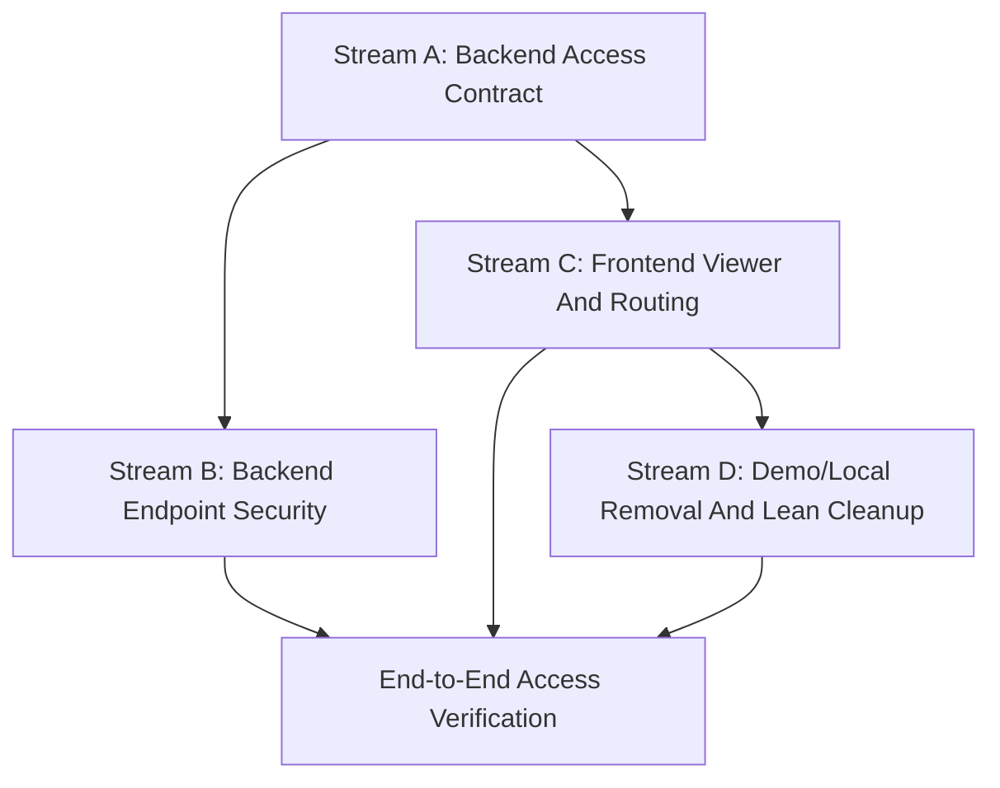

# Parallel Permissions And Routing Implementation Streams

Status: planned  
Scope: `agency-reports` frontend + `client_portal` backend  
Related plan: `docs/implementation/minimal-permissions-routing-architecture-plan.md`

## Purpose

This document turns the minimal permissions and routing architecture into implementation streams that can run in parallel without breaking the access model.

The goal is not to build a large enterprise permission system. The goal is to create the smallest clean foundation where:

- Django is the source of truth for identity, memberships, relationships, roles, and capabilities.
- Frontend route guards and navigation adapt the backend session context, but do not invent authorization.
- Every protected backend endpoint checks access independently.
- Old demo-role, localStorage, and local repository access paths stop acting as access sources.
- Lean product navigation remains limited to auth/account setup and Dental Growth Review.

## Current Code Reality

### Backend

The backend already has part of the new access model in progress:

- `agencies` app exists in the working tree.
- `Agency`, `AgencyMembership`, and `AgencyWorkspaceRelationship` are present.
- `client_portal/settings.py` includes the `agencies` app.
- `Workspace.type` exists with `clinic` and `generic`.
- `workspaces.permissions` has workspace access helpers and agency access helper integration.
- `accounts.views.serialize_user()` already returns a richer session payload:
  - `user`
  - `agency_memberships`
  - `workspace_memberships`
  - `managed_workspace_relationships`
  - temporary compatibility aliases.

Backend gaps:

- Migrations are not confirmed complete.
- Agency tests are missing.
- Endpoint-level permissions are not yet consistently proven.
- Compatibility aliases still exist in `/api/auth/me/`.
- The final frontend-facing session contract needs to be frozen and tested.

### Frontend

The frontend already has part of the new route/auth foundation:

- `djangoSessionAuthClient.js` can map agency memberships, workspace memberships, and managed workspace relationships.
- `ProtectedRoute.jsx` exists and performs authenticated/denied redirects.
- Auth provider can skip old repository route context.
- Lean navigation work has already removed or hidden many non-lean routes.

Frontend gaps:

- Some route access policy still relies on broad/global capability checks instead of resource-scoped access.
- Some old repository/local/demo access paths are still present.
- Growth Review still has demo/Django data source fallback logic.
- Demo/local auth code still exists in the codebase.
- Navigation and redirect behavior should be tied to the backend viewer context only.

## Stream Overview

The work should be split into four streams:

| Stream | Name | Main Output | Can Run In Parallel |
| --- | --- | --- | --- |
| A | Backend Access Contract | Stable `/api/auth/me/` and core access models | Starts first; unblocks all |
| B | Backend Endpoint Security | Protected workspace/Growth Review endpoints | After Stream A helpers stabilize |
| C | Frontend Viewer And Routing | Backend-driven viewer adapter, guards, redirects, navigation | Can start from agreed contract fixture |
| D | Demo/Local Removal And Lean Cleanup | Remove demo/local authority and keep only lean product paths | After Streams A/C define real replacement |

The critical dependency is the session contract. Once Stream A freezes the `/api/auth/me/` payload shape, Streams B, C, and D can move with limited coordination.

## Dependency Graph



## Stream A - Backend Access Contract

### Goal

Make the backend session/access model real, stable, migrated, and tested.

This stream defines what the frontend may know about the viewer. It does not implement frontend behavior.

### Scope

Backend repo:

- `C:\Users\GOD\Documents\GitHub\client_portal\agencies`
- `C:\Users\GOD\Documents\GitHub\client_portal\accounts\views.py`
- `C:\Users\GOD\Documents\GitHub\client_portal\workspaces\models.py`
- `C:\Users\GOD\Documents\GitHub\client_portal\workspaces\permissions.py`
- backend migrations/tests

### Contract Principles

- `User` is identity only.
- `AgencyMembership` determines agency-side access.
- `WorkspaceMembership` determines client/workspace-side access.
- `AgencyWorkspaceRelationship` determines which workspaces an agency may manage.
- Capabilities are scoped by membership and relationship.
- `/api/auth/me/` returns the viewer context, not frontend-specific role guesses.

### Tasks

- [x] Confirm final `/api/auth/me/` response shape.
- [x] Remove ambiguity between snake_case and camelCase at the backend boundary.
- [x] Decide whether backend returns only snake_case or explicitly supports camelCase through a serializer convention.
- [x] Confirm that `user` contains identity fields only: `id`, `email`, `name` or equivalent.
- [x] Confirm agency membership fields:
  - [x] `id`
  - [x] `agency_id`
  - [x] `agency_name`
  - [x] `role`
  - [x] `status`
  - [x] `capabilities`
- [x] Confirm workspace membership fields:
  - [x] `id`
  - [x] `workspace_id`
  - [x] `workspace_name`
  - [x] `workspace_type`
  - [x] `role`
  - [x] `status`
  - [x] `capabilities`
- [x] Confirm managed workspace relationship fields:
  - [x] `agency_id`
  - [x] `workspace_id`
  - [x] `status`
  - [x] optional `capabilities` if relationship-specific capabilities are needed now.
- [x] Generate and review migrations for `agencies`.
- [x] Generate and review migration for `Workspace.type`.
- [x] Register `Agency`, `AgencyMembership`, and `AgencyWorkspaceRelationship` in admin only as needed for development/admin setup.
- [x] Add backend tests for `/api/auth/me/` anonymous behavior.
- [x] Add backend tests for `/api/auth/me/` with workspace-only user.
- [x] Add backend tests for `/api/auth/me/` with agency-only user.
- [x] Add backend tests for `/api/auth/me/` with agency user managing a workspace.
- [x] Add backend tests for inactive memberships being excluded or returned as inactive according to final contract.
- [x] Add backend tests for removed/inactive agency-workspace relationships not granting access.
- [x] Remove temporary compatibility aliases from `/api/auth/me/` once frontend no longer needs them.

### Acceptance Criteria

- [x] Backend migrations apply cleanly on an empty database.
- [x] `/api/auth/me/` returns one canonical contract.
- [x] Session payload does not expose fake/demo roles.
- [x] Session payload does not imply access from `User.role`, `User.agency_id`, `User.client_id`, or username/email.
- [x] Tests prove the four minimum viewer shapes:
  - [x] unauthenticated
  - [x] agency member
  - [x] workspace member
  - [x] agency member with managed workspace relationship.

### Can Run In Parallel With

- Stream C can start from a written fixture of the final `/api/auth/me/` shape before Stream A is fully implemented.
- Stream B can start after permission helper names and expected behavior are stable.

### Should Not Be Mixed With

- Frontend route rewrites.
- Product navigation cleanup.
- Growth Review UI changes.

## Stream B - Backend Endpoint Security

### Goal

Make protected backend endpoints enforce the same access model as the session contract.

Frontend route guards are UX only. This stream ensures real API security.

### Scope

Backend repo:

- workspace permission helpers
- Dental Growth Review endpoints
- source connection/integration endpoints that are workspace-scoped
- workspace/account setup endpoints if they already exist
- backend permission tests

### Access Rules

Workspace member can access workspace data if:

```text
active WorkspaceMembership
+
required workspace capability
```

Agency member can manage or view workspace data if:

```text
active AgencyMembership
+
active AgencyWorkspaceRelationship
+
required agency capability
```

### Minimum Capabilities

Use only capabilities needed for current lean functionality:

- `workspace.create`
- `workspace.manage_relationships`
- `workspace.manage_access`
- `growth_review.view`
- `integrations.manage`
- `account.settings.manage`

If a capability is not needed by an active route or endpoint, do not add it yet.

### Tasks

- [x] Identify every active backend endpoint used by lean frontend routes.
- [x] Mark each endpoint as public, authenticated, workspace-member, agency-managed-workspace, or owner/self.
- [x] Add or reuse permission helper for workspace access.
- [x] Add or reuse permission helper for agency-managed workspace access.
- [x] Ensure Growth Review read endpoint accepts workspace context safely.
- [x] Ensure Growth Review read endpoint allows workspace members with `growth_review.view`.
- [x] Ensure Growth Review read endpoint allows agency members only through active relationship plus `growth_review.view`.
- [x] Ensure integration/source connection endpoints are workspace-scoped.
- [x] Ensure integration/source connection endpoints require `integrations.manage`.
- [x] Ensure account/profile endpoints are user-owned and do not depend on demo role.
- [x] Ensure workspace settings endpoints require workspace membership or agency management capability.
- [x] Add tests for forbidden access to another workspace by URL manipulation.
- [x] Add tests for agency member without relationship being denied.
- [x] Add tests for inactive relationship being denied.
- [x] Add tests for workspace member without required capability being denied.
- [x] Add tests for successful agency-managed workspace access.
- [x] Add tests for successful direct workspace member access.

### Acceptance Criteria

- [x] No protected endpoint relies on frontend-hidden buttons for security.
- [x] No protected endpoint derives access from email, username, demo role, or local-only fields.
- [x] Cross-workspace URL access is denied.
- [x] Agency access requires both membership and relationship.
- [x] Workspace/client access requires workspace membership.
- [x] Permission tests cover allow and deny paths.

### Implementation Notes

- [x] Growth Review read endpoint is protected by workspace membership capability or agency relationship plus `growth_review.view`.
- [x] GHL source-connection sync endpoints are protected by workspace membership capability or agency relationship plus `integrations.manage`.
- [x] Archived workspaces no longer grant workspace resource access through active memberships.
- [x] Inactive agency-workspace relationships do not grant Growth Review or integration sync access.
- [x] Source connections from another workspace are hidden behind the workspace-scoped URL lookup.
- [x] Inactive source connections cannot run sync.
- [x] Account/profile endpoints are implemented as backend account settings APIs.
- [x] Workspace settings endpoints are implemented as backend workspace settings APIs.
- [x] Workspace collection create/list endpoints are implemented with agency `workspace.create` and managed relationship creation.
- [x] Workspace membership list/create/update/remove endpoints are implemented with workspace `workspace.manage_members` or agency `workspace.manage_access`.
- [x] Source connection list/create/detail/update/remove endpoints are implemented with workspace integration capabilities or agency `integrations.manage`.

### Can Run In Parallel With

- Stream C after the endpoint contract names are stable.
- Stream D only after equivalent backend-backed flows exist.

### Should Not Be Mixed With

- Large domain model expansion.
- EHR/EMR integrations.
- Patient-level PHI modeling.
- Advanced permission matrix.

## Stream C - Frontend Viewer And Routing

### Goal

Make frontend auth, route guards, redirects, and navigation derive from the backend viewer context only.

The frontend may decide what to show for UX, but it must not become the authorization source of truth.

### Scope

Frontend repo:

- `C:\Users\GOD\Documents\GitHub\agency-reports\src\app\providers\auth`
- `C:\Users\GOD\Documents\GitHub\agency-reports\src\app\routing`
- route metadata/navigation definitions
- lean app header/navigation
- login redirect behavior
- access denied behavior
- relevant auth/routing tests

### Viewer Adapter Responsibilities

The frontend adapter should map `/api/auth/me/` into a normalized viewer object:

- identity
- agency memberships
- workspace memberships
- managed workspace relationships
- helpers for:
  - has agency capability in an agency
  - has workspace capability in a workspace
  - can agency manage workspace
  - preferred post-login destination

It should not:

- infer role from email/username.
- read access from localStorage.
- use demo roles.
- treat global capabilities as enough for workspace-scoped routes.

### Route Categories

Only these route categories should remain active during lean mode:

- public marketing/landing
- login/auth
- account/profile settings
- agency account/workspace setup
- Dental Growth Review
- access denied/not found

Everything else should be absent from active navigation and unreachable unless explicitly kept as a disabled future route.

### Tasks

- [x] Create final frontend fixture for `/api/auth/me/` based on Stream A contract.
- [x] Update `djangoSessionAuthClient.js` to map only canonical backend fields.
- [x] Remove compatibility paths once backend aliases are removed.
- [x] Normalize viewer identity separately from memberships.
- [x] Add scoped access helper for agency membership capability.
- [x] Add scoped access helper for workspace membership capability.
- [x] Add scoped access helper for agency-managed workspace access.
- [x] Replace broad/global capability checks in route access with scoped checks.
- [x] Ensure client/workspace route access uses the route workspace id as requested resource only.
- [x] Ensure viewer/session object remains unchanged when checking route access.
- [ ] Ensure denied route access redirects to `/access-denied`.
- [ ] Ensure unauthenticated protected route access redirects to `/login?next=<path>`.
- [ ] Define deterministic post-login redirect:
  - [ ] agency owner/admin/operator with workspace management access goes to the lean agency setup/admin destination.
  - [ ] workspace member with `growth_review.view` goes to Dental Growth Review for that workspace.
  - [ ] workspace member without Growth Review access goes to account/workspace settings.
  - [ ] user with no usable membership goes to account setup or access denied, depending on product decision.
- [x] Ensure navigation only renders destinations the viewer can actually open.
- [ ] Keep sidebar disabled for lean mode and route active destinations through the header.
- [ ] Add route guard tests for anonymous viewer.
- [x] Add route guard tests for workspace-only viewer.
- [x] Add route guard tests for agency-managed workspace viewer.
- [x] Add route guard tests for agency member without relationship.
- [x] Add post-login redirect tests.

### Acceptance Criteria

- [ ] Frontend route access is based on backend viewer context only.
- [ ] Navigation and routing agree: no visible nav item opens a denied route.
- [ ] Hidden nav is not treated as security.
- [x] Workspace access is scoped to the requested workspace.
- [x] Agency access requires a matching managed workspace relationship.
- [ ] Demo/local auth is not used by route guards.

### Can Run In Parallel With

- Stream A after the final `/api/auth/me/` fixture is agreed.
- Stream B after endpoint URLs and capability names are known.

### Should Not Be Mixed With

- Redesigning pages.
- Reintroducing sidebar architecture.
- Building future non-lean routes.

## Stream D - Demo/Local Removal And Lean Cleanup

### Goal

Remove old demo-role, localStorage, local repository, and fallback data authority from the active product path.

This stream should be careful: removal should happen only after the real backend-backed path exists for the same workflow.

### Scope

Frontend repo:

- old demo auth services
- local repository/session fallback code
- Growth Review data source fallback
- demo users UI remnants
- inactive route/navigation remnants
- tests that still depend on demo roles/local data

### Removal Rules

Remove old logic when:

- backend endpoint exists,
- frontend adapter can consume it,
- route guard can protect it,
- tests cover the real path.

Do not keep old code as fallback for production behavior. If a development fixture is needed, it must be explicit test fixture code, not an active runtime fallback.

### Tasks

- [x] Inventory all demo/local access sources.
- [x] Remove demo users from login and test expectations.
- [x] Remove demo-role inference from active auth flow.
- [x] Remove username/email-based role inference.
- [x] Remove localStorage-backed session authority from active auth flow.
- [x] Remove repository route context as an access source.
- [x] Remove Growth Review demo data fallback from active runtime path.
- [x] Replace Growth Review data loading with backend API read path.
- [ ] Keep test fixtures only inside test files or explicit test utilities.
- [ ] Remove inactive non-lean navigation entries.
- [ ] Remove inactive non-lean protected routes unless intentionally preserved as future code behind no navigation.
- [ ] Remove dead imports after route cleanup.
- [ ] Update tests that relied on demo roles.
- [ ] Run lint/build after cleanup.

### Acceptance Criteria

- [ ] No active route grants access from localStorage.
- [ ] No active route grants access from demo role.
- [ ] No active route grants access from username/email convention.
- [ ] Growth Review uses backend data in active runtime.
- [ ] Demo data is test-only or deleted.
- [ ] Lean navigation contains only allowed lean destinations.
- [ ] Build and relevant tests pass.

### Implementation Notes

- [x] `AuthProvider` no longer wires the runtime to the local portal repository.
- [x] Active auth now uses Django session auth only.
- [x] Old local auth service methods now fail fast instead of creating local sessions.
- [x] Dental Growth Review no longer falls back to local repository/demo read models.
- [x] `src/app/providers/session/demoSession.js` was removed.
- [x] App shell no longer reads agency workspace clients from the local repository.
- [x] Invitation acceptance route no longer runs the local invitation workflow.
- [x] Account settings, workspace management, workspace access, clinic setup, data sources, and workspace settings routes now show explicit backend-required states instead of using local repository workflows.
- [ ] Account/settings and admin setup pages still need real backend read/write endpoints to replace their old repository callbacks.
- [x] Obsolete local repository/demo assertions were removed from the active test suite.
- [ ] New backend viewer/API contract tests still need to be added for the replacement flows.

### Can Run In Parallel With

- Small inventory work can start immediately.
- Actual removal should happen after Streams A and C provide replacement access paths.

### Should Not Be Mixed With

- Broad UI polish.
- Rebuilding dashboards.
- Adding new non-lean product pages.

## Cross-Stream Sync Points

### Sync Point 1 - Contract Freeze

Required before serious frontend implementation:

- [x] Final `/api/auth/me/` shape documented.
- [x] Capability names documented.
- [x] Membership statuses documented.
- [x] Frontend fixture created from final backend shape.

Output:

- Backend and frontend agree on one viewer contract.

### Sync Point 2 - Backend Access Green

Required before removing old frontend fallback paths:

- [x] Backend migrations apply.
- [x] `/api/auth/me/` tests pass.
- [ ] Endpoint permission tests pass for Growth Review.

Output:

- Frontend has a real backend path to rely on.

### Sync Point 3 - Frontend Guard Green

Required before navigation cleanup is considered complete:

- [x] Route guard tests pass.
- [x] Login redirect tests pass.
- [x] Navigation visibility tests pass or are covered by component tests.

Output:

- User can reach necessary pages and cannot reach denied pages through active routes.

### Sync Point 4 - Demo Authority Removed

Required before calling the refactor complete:

- [ ] No active demo auth path.
- [ ] No active local repository access authority.
- [ ] No active Growth Review demo fallback.
- [ ] Build passes.

Output:

- Product runs on the real backend contract.

## Suggested Execution Order

### Phase 1 - Freeze The Contract

Streams:

- A primary
- C fixture preparation only

Tasks:

- [x] Finish `/api/auth/me/` contract decision.
- [ ] Write frontend fixture for final contract.
- [x] Confirm capability names and statuses.

Why first:

Everything else depends on not guessing the viewer shape.

### Phase 2 - Backend Foundation

Streams:

- A
- B early endpoint inventory

Tasks:

- [x] Add migrations.
- [x] Add backend session tests.
- [x] Finish permission helper tests.
- [ ] Inventory active endpoint protection requirements.

Why second:

The backend must be trustworthy before frontend fallback removal.

### Phase 3 - Frontend Guard And Redirects

Streams:

- C primary
- B endpoint protection continues

Tasks:

- [ ] Update viewer adapter.
- [ ] Update scoped route access policy.
- [ ] Update post-login redirect.
- [ ] Update lean navigation visibility.
- [ ] Add frontend guard tests.

Why third:

Once contract is stable, frontend can stop guessing.

### Phase 4 - Remove Old Authority

Streams:

- D primary
- C cleanup support

Tasks:

- [ ] Remove demo role support from active auth.
- [ ] Remove localStorage session authority from active auth.
- [ ] Remove Growth Review demo fallback.
- [ ] Remove inactive non-lean route/nav remnants.
- [ ] Update tests.

Why fourth:

Removal is safe only after real backend-backed paths exist.

### Phase 5 - Full Verification

Streams:

- A/B/C/D all final checks

Tasks:

- [ ] Backend test suite for auth/access.
- [ ] Frontend lint.
- [ ] Frontend relevant tests.
- [ ] Frontend build.
- [ ] Manual code audit for demo/local leftovers.

Why fifth:

This confirms the architecture is clean, not only functionally patched.

## Work That Can Be Parallelized

### Safe Parallel Work

- Backend migrations/tests and frontend fixture/adapter tests can run in parallel after the contract is frozen.
- Backend endpoint inventory and frontend route inventory can run in parallel.
- Demo/local inventory can run before implementation, as long as removal waits for replacement paths.
- Documentation updates can run in parallel with implementation if they track actual code decisions.

### Unsafe Parallel Work

- Removing frontend fallback before backend endpoints are ready.
- Changing capability names independently in backend and frontend.
- Rewriting navigation while route access policy is unstable.
- Deleting old route code before confirming whether tests still cover lean flows.
- Adding new product pages during permission refactor.

## Minimal Data Contract

The frontend needs this minimum viewer shape:

```json
{
  "user": {
    "id": "user_1",
    "email": "owner@example.com",
    "name": "Clinic Owner"
  },
  "agency_memberships": [
    {
      "id": "am_1",
      "agency_id": "agency_1",
      "agency_name": "Growth Agency",
      "role": "agency_admin",
      "status": "active",
      "capabilities": ["workspace.manage_relationships", "growth_review.view"]
    }
  ],
  "workspace_memberships": [
    {
      "id": "wm_1",
      "workspace_id": "workspace_1",
      "workspace_name": "Green Dental",
      "workspace_type": "clinic",
      "role": "clinic_owner",
      "status": "active",
      "capabilities": ["growth_review.view", "account.settings.manage"]
    }
  ],
  "managed_workspace_relationships": [
    {
      "agency_id": "agency_1",
      "workspace_id": "workspace_1",
      "status": "active"
    }
  ]
}
```

## Minimal Route Policy

### Public

- [ ] landing/home
- [ ] login

### Authenticated Self-Service

- [ ] account/profile settings
- [ ] account deletion flow if available

### Agency-Side Lean Routes

Allowed only if active agency membership has required capability:

- [ ] agency account setup
- [ ] workspace/client setup
- [ ] workspace relationship management

### Workspace/Clinic Routes

Allowed if either direct workspace membership or agency-managed workspace access is valid:

- [ ] Dental Growth Review
- [ ] workspace settings
- [ ] integration setup for that workspace

## Final Completion Checklist

- [x] Stream A complete.
- [x] Stream B complete.
- [ ] Stream C complete.
- [ ] Stream D complete.
- [ ] Backend and frontend agree on one viewer contract.
- [ ] No demo/local access authority remains in active runtime.
- [ ] Lean routes are reachable by the correct users.
- [ ] Denied users get controlled redirects/states.
- [ ] Backend endpoints reject unauthorized workspace access.
- [x] Frontend build passes.
- [x] Backend tests pass for auth/access.

## What This Plan Intentionally Does Not Include

- [ ] Full enterprise RBAC matrix.
- [ ] Custom role builder UI.
- [ ] Patient-level medical records.
- [ ] EHR/EMR integration.
- [ ] Advanced agency team workload views.
- [ ] Non-lean product pages.
- [ ] Sidebar restoration.
- [ ] Dashboard redesign.
- [ ] New analytics widgets.

These can be added later on top of the clean access foundation.
